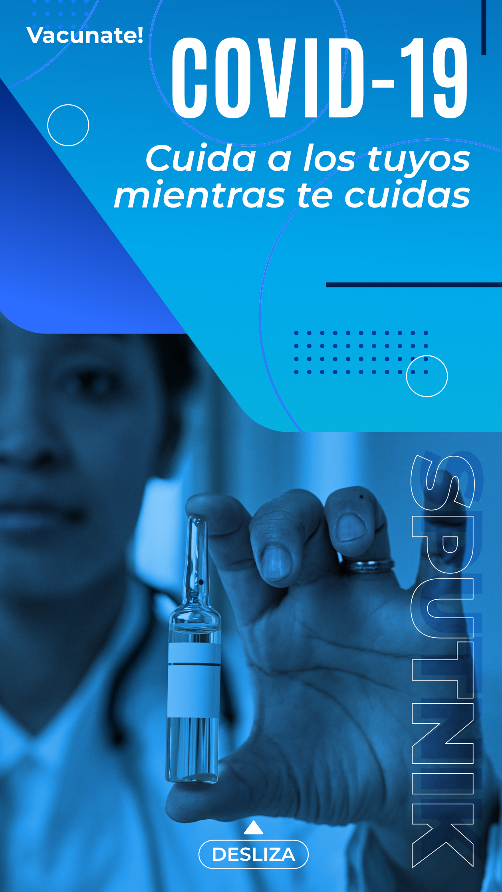
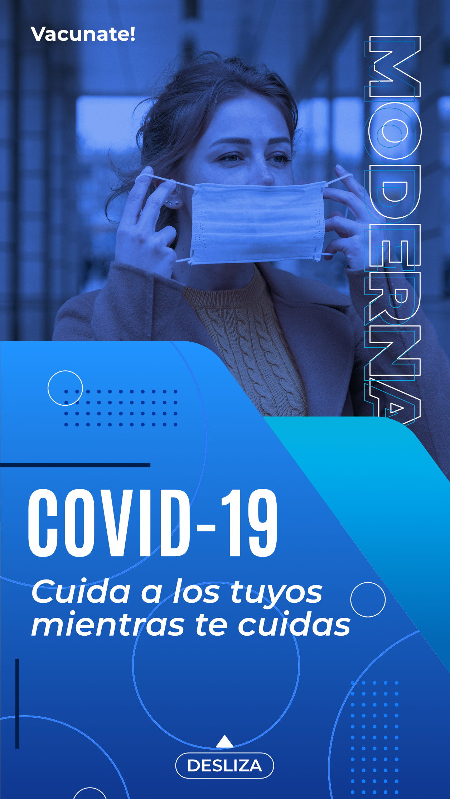

A modo de promocionar el servicio de vacunación pública, se realizará una campaña principalmente basada en redes sociales mediante la creación de cuentas para la marca en Instagram, Facebook y TikTok. Se realizará contenido que brinde al público información sobre las vacunas con un lenguaje muy digerible y un estilo gráfico casual. 

Se realizarán dinámicas de preguntas y respuestas en las 3 plataformas para disipar dudas del público y se compartirá material que redireccione a la página web, buscando de esta forma que la gente pueda agendar su vacuna de manera rápida. Se adjuntan un par de ejemplos del formato de diseño que se utilizará en reels.

Adicional a esto se hará una campaña en Youtube Ads (mostrando spots que hablen del porque es importante vacunarse) que publicite a segmentos poblaciones con los siguientes parámetros:

Demográficos:
Sexo: Hombre y Mujer
Edad: 18-60
Ingreso: Escalonado de presentación de menor a mayor ingreso (Se desplegará más veces a la gente con menores ingresos)

Geográficos:
Región: Nivel Nacional
Área urbana: (Cotejar con los reportes de vacuandos actuales para atacar a faltantes)

Dicha campaña comprenderá 2 pasos, la primera se enfocará en el público que coincide con las fechas próximas de vacunación según su edad y la segunda que se enfocará a los remisos, haciendo del conocimiento de las personas que se seguirá vacunando aun cuando estén en destiempo y se les canalizará posterior a su registro en el sitio web.